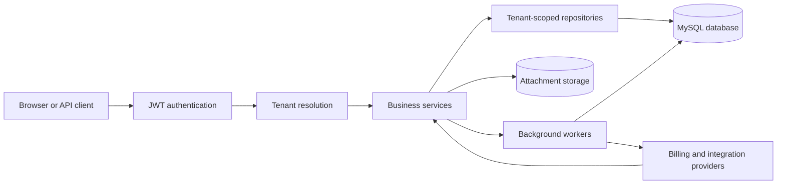

# Phase 72 - Multi-Tenant Threat Model

## Status

Initial Version 3 multi-tenant threat model approved.

Controls are design requirements until their implementation phases are completed
and tested.

## Method

This threat model uses STRIDE:

- Spoofing
- Tampering
- Repudiation
- Information disclosure
- Denial of service
- Elevation of privilege

## Protected Assets

- Organization CRM records
- Customer and lead information
- Contacts, tasks, and notes
- Attachments and stored files
- Reports and exports
- User identities and memberships
- Roles and permissions
- Audit history
- Subscription and billing state
- API keys and webhook secrets
- Workflow and integration credentials
- Database backups

## Potential Actors

- Unauthenticated internet user
- Authenticated organization member
- Suspended or former member
- Malicious organization administrator
- Compromised user account
- Platform administrator
- External integration provider
- Automated API client
- Background worker
- Developer or operator with accidental misconfiguration

## Trust Boundaries

Every boundary must preserve authenticated identity and organization ownership.

## Security Invariants

The following rules must always remain true:

1. Every tenant-owned record belongs to one organization.
2. Every tenant request uses validated organization context.
3. Client-provided organization IDs are never proof of access.
4. Tenant permissions come from active membership.
5. Cross-tenant records are never returned, modified, exported, or downloaded.
6. Platform access is explicit and audited.
7. Background operations carry organization identity explicitly.
8. Tenant context is cleared after every request.
9. Secrets are never returned after initial creation.
10. Suspended and archived organizations cannot perform ordinary CRM operations.

## Threat Register

| ID | STRIDE category | Threat | Required control | Verification |
| --- | --- | --- | --- | --- |
| `TH-001` | Spoofing | User sends another organization’s header | Validate active membership server-side | Cross-organization header test returns `403` |
| `TH-002` | Elevation | Global JWT role grants tenant permissions | Rebuild authorities from membership role | Different roles across two organizations are enforced |
| `TH-003` | Information disclosure | User changes an entity ID to access another tenant | Query by entity ID and organization ID | Cross-tenant read returns `404` |
| `TH-004` | Information disclosure | Repository query forgets tenant scope | Explicit tenant-scoped repository methods | Repository integration tests use two organizations |
| `TH-005` | Tampering | Request body supplies or changes `organization_id` | Ignore ownership fields from client DTOs | Mass-assignment test cannot change ownership |
| `TH-006` | Tampering | Child and parent belong to different organizations | Validate relationship ownership | Cross-tenant customer/contact/task links are rejected |
| `TH-007` | Information disclosure | Attachment storage key exposes another tenant’s file | Authorize metadata and use tenant storage paths | Cross-tenant download and delete tests fail safely |
| `TH-008` | Information disclosure | Reports, search, or exports combine tenants | Tenant-scope all aggregation queries | Export and report totals contain one tenant only |
| `TH-009` | Information disclosure | Cache key omits organization ID | Include organization ID in cache keys | Two tenants with identical record IDs remain separate |
| `TH-010` | Information disclosure | Thread-local context leaks to another request | Clear context in `finally` | Sequential request cleanup test passes |
| `TH-011` | Information disclosure | Background job runs without organization context | Persist and pass organization ID explicitly | Worker processes only its recorded tenant |
| `TH-012` | Spoofing | Invitation token is stolen or replayed | Hash token, expire it, and make acceptance single-use | Repeated or expired acceptance is rejected |
| `TH-013` | Elevation | Organization administrator gains platform access | Separate platform-administrator authorization | Tenant role cannot access `/api/v1/platform/**` |
| `TH-014` | Repudiation | Sensitive action lacks reliable audit evidence | Immutable tenant-aware audit events | Lifecycle and access actions create complete events |
| `TH-015` | Spoofing | Fake or replayed billing webhook changes subscription | Verify signatures and provider event IDs | Invalid and duplicate events are rejected |
| `TH-016` | Information disclosure | API keys or webhook secrets appear in logs or responses | Hash or encrypt, redact, and show once | Secret scanning and response tests pass |
| `TH-017` | Denial of service | One tenant exhausts API, storage, export, or job capacity | Per-user and per-tenant limits | Load tests prove one tenant cannot starve others |
| `TH-018` | Tampering | Migration assigns records to the wrong organization | Default tenant backfill with count validation | Pre/post migration counts match |
| `TH-019` | Information disclosure | Backup restore mixes or exposes tenant data | Protected backups and controlled restore procedures | Restore rehearsal and access review pass |
| `TH-020` | Tampering | Frontend active-organization value is manipulated | Treat frontend state as untrusted | Modified local storage does not grant access |
| `TH-021` | Information disclosure | Native SQL or analytics query bypasses tenant filters | Review every native and aggregate query | Multi-tenant analytics tests pass |
| `TH-022` | Information disclosure | Errors reveal whether another tenant’s record exists | Return safe `404` responses | Cross-tenant enumeration test reveals no record details |

## Controls By Layer

### Frontend

- Store only the selected organization identifier.
- Never store organization secrets in browser storage.
- Add `X-Organization-Id` through the API client.
- Clear organization selection during logout.
- Hide actions without permission, but never treat hiding as security.
- Handle tenant access rejection without exposing internal details.

### Security Filters

- Authenticate global identity first.
- Resolve tenant context second.
- Validate organization and active membership.
- Install membership authorities.
- Clear tenant context in `finally`.
- Skip tenant resolution only for explicitly classified routes.

### Controllers and DTOs

- Do not accept tenant ownership as writable DTO input.
- Use tenant context instead of client ownership fields.
- Validate identifiers and relationship requests.
- Return consistent safe errors.

### Services

- Validate business relationships belong to the active organization.
- Protect last-owner rules.
- Check organization lifecycle status.
- Pass organization ID explicitly to asynchronous operations.
- Create audit events for sensitive actions.

### Repositories

- Include organization scope in tenant-owned queries.
- Avoid generic `findById()` in tenant business flows.
- Scope pagination, sorting, aggregation, and existence checks.
- Review native SQL separately.

### Database

- Require organization ownership after migration.
- Add tenant-first indexes.
- Use tenant-aware unique constraints.
- Preserve foreign-key integrity.
- Protect migration and backup access.

### Files

- Use organization-based storage paths.
- Authorize through metadata before reading physical files.
- Generate storage names.
- Prevent path traversal.
- Validate size and content type.
- Audit upload and deletion.

### Background Workers

- Store organization ID with every job.
- Re-check organization status before execution.
- Apply tenant limits.
- Prevent retries from bypassing suspension.
- Record execution history.

### External Providers

- Verify webhook signatures.
- Reject replayed provider events.
- Use idempotency keys.
- Encrypt recoverable credentials.
- Rotate secrets.
- Separate test and production credentials.

## Platform Administrator Controls

Platform access requires:

- Explicit platform-administrator status
- Strong authentication
- Stated support or administration reason
- Tenant access audit event
- Restricted platform routes
- No silent tenant-filter bypass
- Periodic access review

Future high-risk platform operations should support stronger confirmation or
multi-factor authentication.

## Logging Rules

Logs may include:

- Request correlation ID
- Organization ID
- User ID
- Membership ID
- Action
- Safe error code

Logs must not include:

- Passwords
- Access or refresh tokens
- Invitation tokens
- API keys
- Webhook secrets
- Full sensitive request bodies
- Attachment contents

## Required Security Test Groups

- Tenant header spoofing
- Cross-tenant CRUD
- Cross-tenant relationships
- Search and report isolation
- Export isolation
- Attachment isolation
- Membership suspension
- Organization suspension
- Invitation replay
- Tenant-context cleanup
- Platform-access separation
- Background-job isolation
- Migration ownership validation
- Secret redaction

## Release Blockers

Version 3 cannot be released with:

- Any reproducible cross-tenant data access
- An unscoped tenant repository query
- Missing tenant context cleanup
- Unprotected attachment access
- Unverified migration ownership
- Plain-text API keys
- Unverified billing webhooks
- Platform access without auditing

## Review Triggers

Review this threat model when:

- A tenant-owned table is added
- Authentication or tenant resolution changes
- A cache is introduced
- A background job is added
- A new export or report is added
- File storage changes
- Billing or external integrations are introduced
- Platform-administrator capabilities change