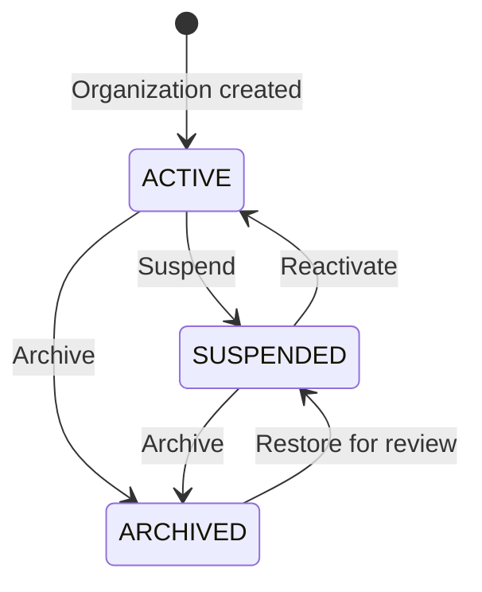

# Phase 72 - Organization Lifecycle Rules

## Status

Organization lifecycle behavior approved for Version 3 design.

Implementation begins after the organization and membership foundations exist.

## Lifecycle States

### `ACTIVE`

The organization is operational.

Allowed behavior:

- Active members may select the organization.
- Authorized users may read and modify CRM data.
- Scheduled tasks, emails, webhooks, and workflows may run.
- API keys may be used when enabled.
- Billing and usage may be recorded.

### `SUSPENDED`

The organization is temporarily unavailable for ordinary CRM operations.

Required behavior:

- Ordinary members cannot access CRM records.
- CRM create, update, archive, and export operations are blocked.
- Background workflows and outbound webhooks are paused.
- API keys are rejected.
- Data and files remain stored.
- Memberships remain unchanged.
- Platform administrators may inspect suspension status.
- Organization owners may access only approved recovery, billing, or support routes.
- Reactivation remains possible.

### `ARCHIVED`

The organization is closed but retained.

Required behavior:

- The organization does not appear as an active workspace.
- Ordinary tenant access is blocked.
- CRM data becomes unavailable through normal organization routes.
- New business records cannot be created.
- API keys, workflows, webhooks, and scheduled operations remain disabled.
- Data, audit logs, and attachments remain retained.
- Membership and role history remains retained.
- Restoration requires an explicit authorized action.
- Hard deletion is not part of the ordinary lifecycle.

## State Transition Diagram

An archived organization is restored to `SUSPENDED` first.

It must pass security, ownership, and billing checks before returning to `ACTIVE`.

## Organization Creation

Organization creation is a global authenticated operation.

Creation must happen inside one database transaction.

Required steps:

1. Confirm that the global user is active.
2. Validate and normalize the organization name.
3. Generate or validate a unique lowercase slug.
4. Create the organization as `ACTIVE`.
5. Create an `OWNER` membership for the creator.
6. Create the default `General` team when team support is active.
7. Assign the owner membership appropriately.
8. Create an organization-created audit event.
9. Return the new organization and membership.

If any required step fails, the complete transaction rolls back.

An organization must never exist without at least one active owner.

## Slug Rules

Organization slugs:

- Use lowercase letters, numbers, and hyphens
- Cannot begin or end with a hyphen
- Cannot contain consecutive unsupported separators
- Must be globally unique
- Must reject reserved platform words

Initial reserved slugs should include:

- `api`
- `admin`
- `platform`
- `auth`
- `login`
- `support`
- `billing`
- `system`
- `www`

Changing a slug must be restricted and audited.

## Suspension

Suspension is reversible.

Possible suspension actors:

- Authorized platform administrator
- Automated billing enforcement after an approved grace period
- Security incident response process
- Organization owner when self-service suspension is supported

A suspension action requires:

- Authorized actor
- Reason
- Timestamp
- Previous organization status
- Audit event

Suspension must not:

- Delete organization data
- Delete memberships
- Revoke global user accounts
- Remove stored attachments
- Change subscription history

## Reactivation

A suspended organization may return to `ACTIVE` only when:

- The organization has at least one active owner
- The suspension reason has been resolved
- Required security checks pass
- Subscription conditions pass when billing enforcement exists
- The actor has reactivation authority

Reactivation must:

- Create an audit event
- Resume eligible organization operations
- Preserve historical suspension information
- Avoid automatically reactivating inactive memberships

## Archival

Archival is stronger than suspension.

Authorized actors:

- Active organization owner with explicit confirmation
- Platform administrator with an audited reason

Before archival:

- Verify that the actor is authorized.
- Require an explicit confirmation action.
- Record the archival reason.
- Confirm that retention requirements are understood.
- Pause organization background processing.

Archival must not physically delete database rows or attachment files.

## Restoration

Restoration changes an organization from `ARCHIVED` to `SUSPENDED`.

Restoration requires:

- Authorized organization owner or platform administrator
- Audit event
- Validation that retained data is available
- Validation of at least one active owner
- Security and billing review before activation

Restoration must not silently return the organization directly to `ACTIVE`.

## Last Owner Protection

An active or suspended organization must have at least one active `OWNER`.

The system must reject:

- Removing the last active owner
- Deactivating the last owner membership
- Changing the last owner to a lower role
- Allowing the last owner’s global account to be deactivated without transfer

Expected error code:

`LAST_ACTIVE_OWNER_REQUIRED`

Ownership transfer must be completed before the previous final owner loses access.

## Membership Behavior

Organization status changes do not automatically change membership status.

Examples:

- Suspending an organization leaves memberships unchanged.
- Reactivating an organization does not reactivate inactive memberships.
- Archiving an organization retains all membership history.
- Restoring an organization retains previous membership states.

Both organization and membership must be active for ordinary tenant access.

## Background Processing Behavior

Scheduled tasks, webhooks, email automations, workflows, and integrations must
check organization status before execution.

For suspended or archived organizations:

- New executions are not started.
- Pending executions are paused or safely cancelled according to their type.
- Retry workers must not bypass organization status.
- Organization ID remains attached to execution history.

Security-critical platform notifications may still be sent where appropriate.

## Billing Separation

Organization lifecycle and subscription lifecycle are separate concepts.

Examples:

- An organization may be `ACTIVE` while using a trial subscription.
- A subscription may be overdue while the organization remains active during grace.
- Billing enforcement may later suspend an organization.
- Payment success does not automatically reactivate a security-suspended organization.

Billing code must record why an organization was suspended.

## API Behavior

Expected lifecycle errors:

| Situation | Status | Error code |
| --- | --- | --- |
| Organization not found | 404 | `ORGANIZATION_NOT_FOUND` |
| Organization suspended | 403 | `ORGANIZATION_SUSPENDED` |
| Organization archived | 403 | `ORGANIZATION_ARCHIVED` |
| Invalid state transition | 409 | `INVALID_ORGANIZATION_TRANSITION` |
| Last owner removal attempted | 409 | `LAST_ACTIVE_OWNER_REQUIRED` |
| Missing transition authority | 403 | `ORGANIZATION_MANAGEMENT_DENIED` |

Repeated requests for an already completed transition should not create
duplicate audit events.

## Concurrency Protection

Lifecycle updates must prevent two administrators from overwriting each other.

Recommended implementation direction:

- Add optimistic locking to the organization entity
- Use an entity version value
- Reject stale lifecycle updates
- Run owner-count validation and membership changes transactionally

The exact version field will be added to the final implementation model before
Phase 73 coding.

## Audit Requirements

Organization lifecycle audit records should include:

- Organization ID
- Actor user ID
- Actor membership ID when applicable
- Previous status
- New status
- Reason
- Timestamp
- Whether the action was manual or automated

## Hard Deletion

Hard deletion is outside the normal Version 3 organization lifecycle.

A future compliance deletion process must separately define:

- Legal retention
- Backup retention
- Attachment deletion
- Audit-log handling
- Billing-record retention
- Irreversible confirmation
- Platform authorization

## Required Tests

- Organization creation creates one owner membership
- Failed creation rolls back completely
- Duplicate slug is rejected
- Suspended organization blocks CRM access
- Archived organization blocks workspace selection
- Suspended organization can be reactivated
- Archived organization restores to suspended
- Last active owner cannot be removed
- Inactive memberships remain inactive after reactivation
- Background operations do not run for suspended organizations
- Every lifecycle transition creates one audit event
- Invalid transitions return `409`