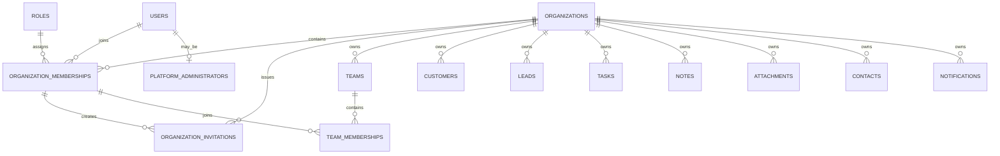

# Phase 72 - Tenant Data Model

## Status

Target Version 3 tenant data model approved for detailed architecture work.

No SQL migration or Java entity has been created during this step.

## Core Decisions

- Use one shared MySQL database and shared schema.
- Use `organizations` as the tenant root.
- Keep `users` as global login identities.
- Connect users and organizations through memberships.
- Keep permissions and standard role definitions platform-level.
- Assign organization roles through memberships.
- Keep platform-administrator access separate from tenant roles.
- Give every tenant-owned business record direct organization ownership.

## Organization Model

Table: `organizations`

| Field | Type direction | Required | Purpose |
| --- | --- | --- | --- |
| `id` | BIGINT | Yes | Primary key |
| `name` | VARCHAR(150) | Yes | Display name |
| `slug` | VARCHAR(100) | Yes | Globally unique URL-safe identifier |
| `status` | VARCHAR(30) | Yes | Organization lifecycle status |
| `time_zone` | VARCHAR(60) | Yes | Organization reporting and scheduling timezone |
| `created_by_user_id` | BIGINT | Yes | Global user who created the organization |
| `version` | BIGINT | Yes | Optimistic-lock value for lifecycle changes |
| `created_at` | TIMESTAMP | Yes | Creation time |
| `updated_at` | TIMESTAMP | Yes | Last update time |

### Organization Statuses

- `ACTIVE`: normal access allowed
- `SUSPENDED`: business data retained but ordinary access restricted
- `ARCHIVED`: organization closed and retained for recovery or compliance

Trial and payment status must belong to subscriptions, not organization status.

### Organization Rules

- Slug is globally unique.
- Slug is lowercase and URL-safe.
- Organization hard deletion is not part of normal application behavior.
- Suspension and archival must create audit records.
- Archived organizations cannot create new business records.

## Organization Membership Model

Table: `organization_memberships`

| Field | Type direction | Required | Purpose |
| --- | --- | --- | --- |
| `id` | BIGINT | Yes | Primary key |
| `organization_id` | BIGINT | Yes | Organization membership belongs to |
| `user_id` | BIGINT | Yes | Global user identity |
| `role_id` | BIGINT | Yes | Organization role |
| `status` | VARCHAR(30) | Yes | Membership lifecycle status |
| `joined_at` | TIMESTAMP | Yes | Time membership became active |
| `created_at` | TIMESTAMP | Yes | Record creation time |
| `updated_at` | TIMESTAMP | Yes | Last update time |

### Membership Statuses

- `ACTIVE`: user can work in the organization
- `SUSPENDED`: access temporarily blocked
- `INACTIVE`: membership ended but history retained

### Membership Constraints

- Unique `(organization_id, user_id)`
- Organization must be active for ordinary access.
- User must be active globally.
- Membership must be active.
- Role must be an approved organization role.
- Membership changes must be audited.

## Role Model

Version 3 initially keeps standard roles as global templates:

- `OWNER`
- `ADMIN`
- `MANAGER`
- `SALES_REP`
- `SUPPORT_STAFF`

### Role Rules

- `OWNER` manages organization ownership and billing.
- `ADMIN` manages ordinary organization administration.
- `MANAGER` manages teams and supervised CRM activity.
- `SALES_REP` manages permitted sales records.
- `SUPPORT_STAFF` manages permitted customer-support records.
- Roles are assigned through organization memberships.
- Organization roles never grant platform-administrator access.
- Custom organization-created roles are postponed until a later version.

The existing `users.role_id` will eventually be replaced by membership role
assignment.

## Permission Model

The `permissions` table remains a global permission catalogue.

The `role_permissions` table remains a global mapping for standard role templates
during Version 3.

New tenant permissions may include:

- `ORGANIZATION_VIEW`
- `ORGANIZATION_UPDATE`
- `MEMBERSHIP_VIEW`
- `MEMBERSHIP_INVITE`
- `MEMBERSHIP_UPDATE`
- `MEMBERSHIP_DEACTIVATE`
- `TEAM_MANAGE`
- `BILLING_VIEW`
- `BILLING_MANAGE`
- `API_KEY_MANAGE`
- `WEBHOOK_MANAGE`
- `WORKFLOW_MANAGE`

Organization administrators may assign approved roles, but cannot change the
global permission catalogue.

## Organization Invitation Model

Table: `organization_invitations`

| Field | Type direction | Required | Purpose |
| --- | --- | --- | --- |
| `id` | BIGINT | Yes | Primary key |
| `organization_id` | BIGINT | Yes | Target organization |
| `email` | VARCHAR(150) | Yes | Normalized invited email |
| `role_id` | BIGINT | Yes | Intended organization role |
| `token_hash` | VARCHAR(255) | Yes | Secure invitation-token hash |
| `status` | VARCHAR(30) | Yes | Invitation lifecycle |
| `invited_by_membership_id` | BIGINT | Yes | Organization member who invited |
| `expires_at` | DATETIME | Yes | Expiration time |
| `accepted_at` | DATETIME | No | Acceptance time |
| `revoked_at` | DATETIME | No | Revocation time |
| `created_at` | TIMESTAMP | Yes | Creation time |
| `updated_at` | TIMESTAMP | Yes | Last update time |

### Invitation Statuses

- `PENDING`
- `ACCEPTED`
- `EXPIRED`
- `REVOKED`

### Invitation Rules

- Store token hashes, never raw invitation tokens.
- Invitation email is normalized to lowercase.
- Expired or revoked invitations cannot be accepted.
- Accepting an invitation creates or activates one membership.
- Acceptance must verify that the authenticated user email matches the invitation.
- Repeated acceptance must be safely rejected.
- Invitation actions must be audited.

## Team Model

The existing `teams` table becomes tenant-owned.

Target additions and changes:

- Add required `organization_id`
- Team name becomes unique by `(organization_id, name)`
- Replace direct global manager assumptions with organization-membership validation
- Replace `manager_user_id` with nullable `manager_membership_id`
- Manager membership must belong to the same organization
- Keep `ACTIVE` and `INACTIVE` statuses

## Team Membership Model

Table: `team_memberships`

| Field | Type direction | Required | Purpose |
| --- | --- | --- | --- |
| `id` | BIGINT | Yes | Primary key |
| `team_id` | BIGINT | Yes | Organization team |
| `organization_membership_id` | BIGINT | Yes | Organization member |
| `status` | VARCHAR(30) | Yes | Team membership status |
| `joined_at` | TIMESTAMP | Yes | Team joining time |
| `left_at` | TIMESTAMP | No | Time membership ended |
| `created_at` | TIMESTAMP | Yes | Record creation time |

Team membership statuses:

- `ACTIVE`
- `INACTIVE`

### Team Membership Rules

- Team and membership must belong to the same organization.
- A membership initially belongs to at most one active team per organization.
- A team manager must be an active member of the same organization.
- Existing `users.team_id` will eventually be removed after migration.

## Platform Administrator Model

Table: `platform_administrators`

| Field | Type direction | Required | Purpose |
| --- | --- | --- | --- |
| `user_id` | BIGINT | Yes | Primary key and global user identity |
| `status` | VARCHAR(30) | Yes | Platform access status |
| `granted_by_user_id` | BIGINT | No | Administrator who granted access |
| `granted_at` | TIMESTAMP | Yes | Access grant time |
| `revoked_at` | TIMESTAMP | No | Access revocation time |

Platform administrator statuses:

- `ACTIVE`
- `REVOKED`

### Platform Administrator Rules

- Platform access is not represented by an organization role.
- Platform access must be explicitly checked.
- Support access into an organization requires an audited reason.
- Platform administrators do not silently bypass tenant isolation.
- Platform access grants and revocations must be audited.

## Tenant Ownership Pattern

The following tables will receive required `organization_id` ownership:

- `teams`
- `customers`
- `contacts`
- `leads`
- `tasks`
- `notes`
- `attachments`
- `notifications`

The following table uses hybrid ownership:

- `audit_logs`

`audit_logs.organization_id` may be null only for explicit platform events.
A separate scope value must distinguish `PLATFORM` from `ORGANIZATION`.

## Relationship Diagram

## Request-Time Access Requirements

A tenant-owned request requires all of the following:

1. Authenticated active global user
2. Requested organization
3. Active organization
4. Active organization membership
5. Required permission through the membership role
6. Entity ownership matching the organization

Failure at any stage denies access.

## Index Requirements

Required foundational indexes include:

- Unique organization slug
- Unique organization membership by organization and user
- Membership lookup by user and status
- Membership lookup by organization and status
- Invitation lookup by token hash
- Invitation lookup by organization, email, and status
- Team lookup by organization and status
- Tenant-owned business indexes beginning with `organization_id`

## Migration Boundaries

Phase 73 creates only the organization foundation.

Later phases will separately introduce:

- Organization memberships
- Invitation flows
- Tenant request context
- Business-record ownership
- Existing-data backfill
- Removal of obsolete user role and team fields

No migration should attempt all tenancy changes at once.

## Deferred Decisions

The following remain outside the initial Version 3 tenant foundation:

- Custom organization-created roles
- Nested teams
- Users belonging to multiple teams in one organization
- Organization hard deletion
- Database-per-tenant enterprise plans
- Region-specific tenant databases
