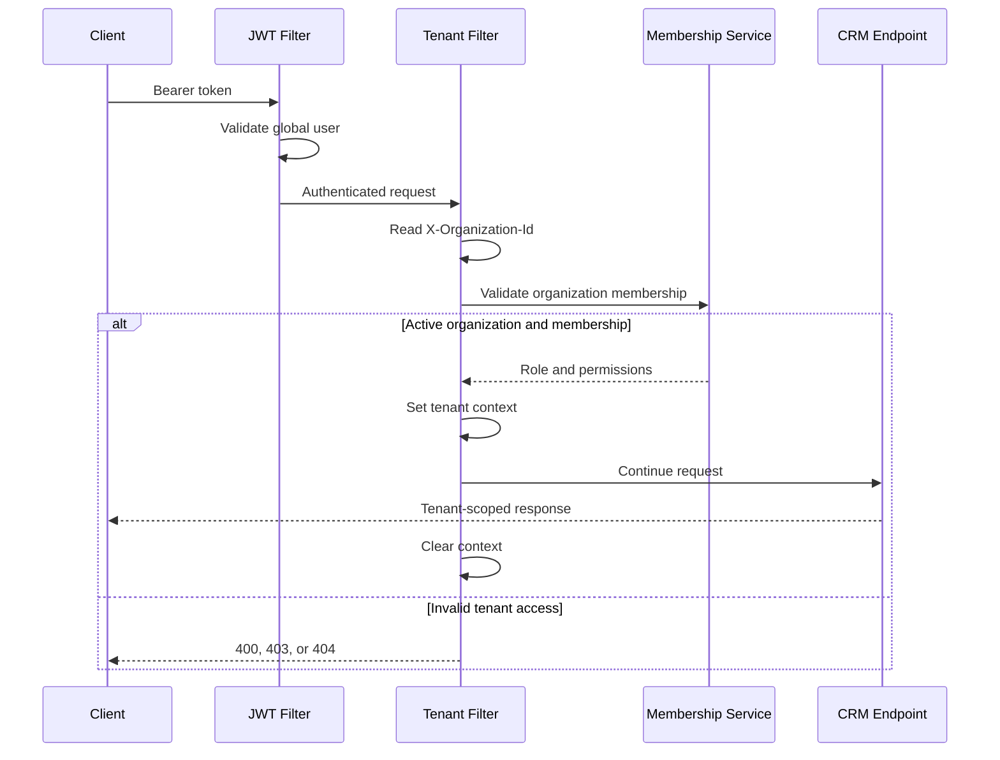

# Phase 72 - Tenant Request Resolution Design

## Status

Tenant request-resolution design approved.

Implementation is scheduled for Phase 76 after organizations, memberships,
and the bootstrap migration exist.

## Current Authentication State

The current application:

- Uses JWT bearer authentication
- Loads one global role from `users.role_id`
- Loads permissions through the global role
- Stores role information inside the access token
- Has no organization context
- Allows only `Authorization` and `Content-Type` CORS headers

This remains functional until the membership migration is ready.

## Target Security Principle

The access token proves global user identity.

The `X-Organization-Id` header requests an active organization.

An active organization membership proves access.

The header alone never proves authorization.

## Endpoint Categories

### Public Endpoints

Do not require authentication or tenant context.

Examples:

- `/api/v1/auth/login`
- `/api/v1/auth/refresh`
- `/api/v1/auth/forgot-password`
- `/api/v1/auth/reset-password`
- `/actuator/health`
- `/actuator/info`

### Global Authenticated Endpoints

Require an authenticated user but do not require active tenant context.

Examples:

- `/api/v1/auth/me`
- Password-change endpoint
- List the user’s organizations
- Create an organization
- Accept an organization invitation
- Global account preferences
- Approved recovery and billing routes for owners of suspended or archived organizations

### Tenant-Owned Endpoints

Require authentication, organization context, active membership, and permission.

Examples:

- Customers
- Leads
- Contacts
- Tasks
- Notes
- Attachments
- Teams
- Organization users and memberships
- Dashboard
- Reports
- Audit logs
- Notifications

### Platform Endpoints

Require explicit platform-administrator access.

Recommended route prefix:

`/api/v1/platform/**`

Platform routes must not rely on an organization role.

## Organization Header

Header name:

`X-Organization-Id`

Example:

`X-Organization-Id: 42`

### Header Rules

- Required for tenant-owned routes
- Must contain a positive numeric organization ID
- Ignored as proof of authorization
- Validated against active membership
- Must be allowed by CORS
- Must never be taken from request bodies as a substitute for tenant context

## Request Processing Order

1. Request enters Spring Security.
2. JWT filter reads the bearer token.
3. JWT filter authenticates the global user.
4. Tenant filter determines whether the route requires tenant context.
5. Tenant filter reads `X-Organization-Id`.
6. Tenant filter validates the header format.
7. Organization service confirms that the organization is active.
8. Membership service loads an active membership for the user and organization.
9. Membership role and permissions are loaded.
10. Tenant context is created.
11. Tenant-specific authorities are installed for the request.
12. Controller and service execute.
13. Tenant context is cleared in a `finally` block.

## Filter Ordering

Target Spring Security order:

```text
JwtAuthenticationFilter
        ↓
TenantResolutionFilter
        ↓
Authorization and controller handling
```

Target configuration direction:

- JWT filter runs before `UsernamePasswordAuthenticationFilter`
- Tenant filter runs after `JwtAuthenticationFilter`
- Tenant filter runs before controllers and method security

## Tenant Context Model

The request-scoped tenant context should be immutable.

Expected fields:

- `organizationId`
- `membershipId`
- `userId`
- `roleName`
- `dataScope`
- Permission set
- Team membership information when required

The context must not contain passwords, tokens, or secret values.

## Context Storage

Initial implementation direction:

- Use a dedicated `TenantContextHolder`
- Store context in a `ThreadLocal`
- Set context only after full validation
- Clear context in a `finally` block
- Reject tenant service access when context is absent

Thread-local tenant context must never be reused by background jobs.

Background work receives organization ID explicitly.

## Membership Authorization

For tenant routes, authorities must come from the active membership role.

The existing global `users.role_id` must not remain the final source of tenant
authorization.

Target tenant authorities include:

- `ROLE_OWNER`
- `ROLE_ADMIN`
- `ROLE_MANAGER`
- `ROLE_SALES_REP`
- `ROLE_SUPPORT_STAFF`
- Membership-role permissions

Existing `@PreAuthorize` permission checks can continue working after request
authorities are rebuilt from the membership role.

## JWT Target State

The final access token should represent global identity and session validity.

Expected claims:

- Subject or email
- Global user ID
- Issued time
- Expiration time
- Optional session identifier

Tenant role and tenant permissions should not be trusted from the JWT because:

- Users can switch organizations
- Roles can differ between organizations
- Memberships can be suspended
- Permissions can change before the token expires

Existing role claims may remain temporarily during migration but must be ignored
for tenant authorization.

## Tenant Resolution Flow



## Error Rules

| Situation | Status | Error code |
| --- | --- | --- |
| Missing bearer token | 401 | `UNAUTHORIZED` |
| Missing required organization header | 400 | `TENANT_CONTEXT_REQUIRED` |
| Invalid organization-header format | 400 | `INVALID_ORGANIZATION_ID` |
| No active membership | 403 | `ORGANIZATION_ACCESS_DENIED` |
| Organization suspended or archived | 403 | `ORGANIZATION_UNAVAILABLE` |
| Tenant-owned record outside active organization | 404 | `RESOURCE_NOT_FOUND` |
| Platform route without platform access | 403 | `PLATFORM_ACCESS_DENIED` |

Cross-tenant record access should normally return `404` to avoid revealing that
the record exists.

## Frontend Behavior

The frontend will eventually:

1. Log in using global credentials.
2. Load the user’s active organization memberships.
3. Automatically select the organization when only one is available.
4. Show a workspace selector when several are available.
5. Store the selected ID as `activeOrganizationId`.
6. Add `X-Organization-Id` to tenant-owned API requests.
7. Clear active organization selection during logout.
8. Revalidate selection when access is denied.

The organization ID is not a secret. Server-side membership validation remains
mandatory.

## CORS Change

The backend CORS configuration will later allow:

- `Authorization`
- `Content-Type`
- `X-Organization-Id`

This change belongs to Phase 76 implementation.

## Refresh Token Behavior

Refresh tokens remain linked to the global user.

Refreshing an access token does not grant organization access.

After refresh, every tenant request still requires membership validation.

## Compatibility Strategy

To protect existing Version 2 behavior:

- Phase 73 creates organization foundation only.
- Phase 74 creates memberships.
- Phase 75 creates the default organization and migrates existing users and data.
- Phase 76 activates tenant resolution.
- Phase 77 enforces tenant-scoped repositories.
- Old user-level role and team columns remain until migration validation passes.

No silent tenant fallback should remain in the final Version 3 release.

## Required Tests

### Authentication Tests

- Invalid JWT returns `401`
- Expired JWT returns `401`
- Valid JWT establishes global identity

### Tenant Header Tests

- Missing header on tenant route returns `400`
- Malformed header returns `400`
- Header is not required for public routes
- Header is not required for global authenticated routes

### Membership Tests

- Active membership allows access
- Suspended membership returns `403`
- Inactive membership returns `403`
- Membership in another organization returns `403`

### Isolation Tests

- User in Organization A cannot read Organization B records
- User in Organization A cannot update Organization B records
- User in Organization A cannot download Organization B attachments
- Tenant context is cleared after every request

### Permission Tests

- Membership role permissions control access
- Global user role does not grant tenant access
- Organization administrator does not receive platform access

## Future Implementation Files

Likely backend files:

- `security/tenant/TenantContext.java`
- `security/tenant/TenantContextHolder.java`
- `security/tenant/TenantResolutionFilter.java`
- `security/tenant/TenantRoutePolicy.java`
- Organization membership service and repository
- Updated `SecurityConfig.java`

Likely frontend files:

- Organization service
- Active organization state
- Workspace selector
- Updated `services/api.ts`

These files are not created during Phase 72.
