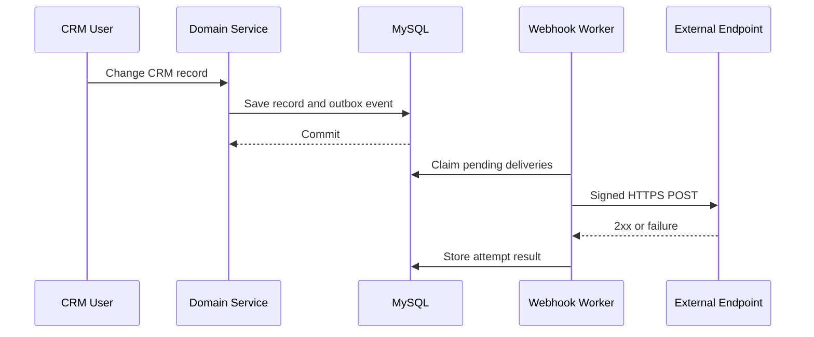

# Phase 86 - Webhook Events and Security Design

## Goal

Notify approved external systems about important CRM changes without weakening tenant isolation, leaking secrets, or making normal CRM transactions depend on an external endpoint.

This document covers outbound CRM webhooks. The existing inbound Stripe billing webhook remains separate under `/api/v1/billing/webhooks/stripe`.

## Design Decisions

- Management endpoints use `/api/v1/webhook-subscriptions`.
- Outbound payloads use schema version `1` and event names such as `customer.created`.
- Events are stored in a transactional outbox before background delivery.
- Delivery is at least once; consumers must deduplicate by event ID.
- Each subscription belongs to exactly one organization.
- Webhooks require the `WEBHOOKS` subscription feature.
- Endpoints are HTTPS-only outside explicitly enabled local development.
- Signing secrets are encrypted at rest and returned only when created or rotated.
- Redirects are never followed.
- Payloads are built from allowlisted DTOs, never serialized JPA entities.

## Initial Event Catalog

| Event | Trigger | Minimum data |
| --- | --- | --- |
| `customer.created` | Customer transaction commits | Customer ID and safe customer snapshot |
| `customer.updated` | Customer transaction commits | Customer ID, safe snapshot, changed field names |
| `customer.archived` | Customer is archived | Customer ID and archive status |
| `customer.restored` | Customer is restored | Customer ID and active status |
| `lead.created` | Lead transaction commits | Lead ID and safe lead snapshot |
| `lead.updated` | Lead transaction commits | Lead ID, safe snapshot, changed field names |
| `lead.archived` | Lead is archived | Lead ID and archive status |
| `lead.converted` | Lead conversion transaction commits | Lead ID and resulting customer ID |
| `contact.created` | Contact transaction commits | Contact ID and customer ID |
| `contact.updated` | Contact transaction commits | Contact ID, customer ID, changed field names |
| `task.created` | Task transaction commits | Task ID, status, assignee ID, and due date |
| `task.updated` | Task transaction commits | Task ID, status, and changed field names |
| `task.completed` | Task becomes completed | Task ID, assignee ID, and completion time |
| `note.created` | Note transaction commits | Note ID and related customer or lead ID |

New event types require a reviewed payload contract and security test. Existing payload fields are additive within schema version `1`; removals or semantic changes require a new schema version.

## Event Envelope

Every delivery uses the following stable envelope:

```json
{
  "id": "evt_01J...",
  "schemaVersion": 1,
  "type": "customer.created",
  "occurredAt": "2026-09-06T12:30:00Z",
  "organizationId": "1",
  "data": {
    "customer": {
      "id": 42,
      "name": "Example Customer"
    }
  }
}
```

Rules:

- `id` is globally unique and remains unchanged across retries.
- `occurredAt` records the committed business event time, not retry time.
- `organizationId` comes from server-side tenant context only.
- `data` is event-specific and allowlisted.
- Passwords, tokens, API keys, signing secrets, billing credentials, internal stack traces, and unrestricted entity graphs are forbidden.
- Optional values are JSON `null` or omitted consistently per DTO contract.

## Subscription Lifecycle

Statuses:

- `ACTIVE`: eligible for new deliveries.
- `DISABLED`: paused by an organization administrator.
- `FAILED`: automatically paused after repeated terminal failures.
- `REVOKED`: permanently deleted from use while retained for audit history.

Management operations:

- List and inspect subscriptions.
- Create a subscription and display its signing secret once.
- Update name, endpoint URL, and subscribed events.
- Enable or disable delivery.
- Rotate the signing secret.
- Revoke a subscription.
- View delivery history and request an authorized replay.

All management operations require the authenticated organization, the `WEBHOOKS` plan feature, and a dedicated `WEBHOOK_MANAGE` permission. Read-only history may use `WEBHOOK_VIEW`.

Repository lookups must include both subscription ID and organization ID. Request bodies cannot select or override an organization.

## Secret Generation and Storage

Signing secrets use:

`whsec_<base64url-random-secret>`

- Generate at least 256 bits with `SecureRandom`.
- Return the complete secret only after create or rotate.
- Store the secret with AES-256-GCM authenticated encryption because the sender must recover it to sign deliveries.
- Load the versioned key ring from `WEBHOOK_SECRET_ENCRYPTION_KEYS` and select the active version with `WEBHOOK_SECRET_ENCRYPTION_KEY_VERSION`; never store real keys in Git or the database.
- Store ciphertext, nonce, authentication tag, encryption-key version, and a safe display suffix.
- Never log raw secrets, ciphertext, signatures, or request authorization headers.

Rotation creates a new primary secret immediately. For a maximum 24-hour grace period, deliveries may include signatures from the new and previous secrets. The previous encrypted secret is erased after the grace period. Revocation erases all usable encrypted secrets.

## Request Signing

Outbound requests contain:

```text
Content-Type: application/json
User-Agent: Tadamun-Webhooks/1.0
X-Tadamun-Event-Id: evt_01J...
X-Tadamun-Event-Type: customer.created
X-Tadamun-Delivery-Id: dlv_01J...
X-Tadamun-Signature: t=1788697800,v1=<lowercase-hex-hmac>
```

Signature input is the exact UTF-8 bytes of:

```text
<unix-timestamp>.<raw-request-body>
```

The signature is `HMAC-SHA-256(signing-secret, signature-input)`. During rotation the header can contain multiple `v1` values.

Consumer verification guidance:

1. Parse the timestamp and one or more `v1` signatures.
2. Reject timestamps more than five minutes from the receiver's current time.
3. Compute HMAC over the unmodified raw body.
4. Compare signatures in constant time.
5. Deduplicate successfully processed event IDs.

## Endpoint Security and SSRF Protection

Before saving and before every delivery:

- Require an absolute `https` URL in production.
- Allow `http://localhost` only when `WEBHOOK_ALLOW_LOCAL_HTTP=true` in a local profile.
- Reject URL user information, fragments, malformed hosts, and unsupported ports.
- Resolve all host addresses and reject loopback, private, link-local, multicast, unspecified, and reserved IPv4/IPv6 ranges.
- Reject cloud metadata destinations such as `169.254.169.254`.
- Re-resolve immediately before connection to reduce DNS-rebinding risk.
- Disable redirects instead of following them to an unvalidated destination.
- Use a dedicated HTTP client with connection and response timeouts.
- Cap response bytes retained for diagnostics.

Suggested initial limits:

- Connection timeout: 3 seconds.
- Total response timeout: 10 seconds.
- Request body maximum: 256 KiB.
- Stored response body maximum: 4 KiB, sanitized.
- Maximum active subscriptions per organization: 20.

## Reliable Delivery

CRM writes and event creation occur in one database transaction:



- A successful `2xx` response completes the delivery.
- Network errors, timeouts, `408`, `425`, `429`, and `5xx` are retryable.
- Other `4xx` responses are terminal for that delivery.
- `410 Gone` disables the subscription.
- A valid `Retry-After` from `429` is honored within configured bounds.
- Suggested attempts: immediate, 1 minute, 5 minutes, 30 minutes, 2 hours, and 12 hours.
- After the final attempt, mark the delivery `DEAD` and retain it for inspection or manual replay.
- Repeated dead deliveries place the subscription in `FAILED` status and notify organization administrators.
- Ordering is best effort, not guaranteed. Consumers use `occurredAt` and event IDs.

Workers claim rows using database locking so one delivery is not sent concurrently by multiple workers. A stale claim timeout returns abandoned work to the queue.

## Persistence Model for Phase 86.2

`webhook_subscriptions`:

- organization, name, endpoint URL, status
- encrypted current and optional previous secret material
- secret display suffix and key version
- previous-secret expiration
- failure count and last success/failure time
- created/updated/revoked actor and timestamps
- optimistic-lock version

`webhook_subscription_events`:

- subscription ID and event type
- unique pair constraint

`webhook_events`:

- public event ID, organization, type, schema version
- aggregate type and aggregate ID
- immutable JSON payload and occurrence time
- creation and publication status

`webhook_deliveries`:

- public delivery ID, event ID, subscription ID
- status, attempt count, next attempt time, claim time
- last HTTP status, duration, sanitized error, completion time
- unique event/subscription pair for idempotent fan-out

`webhook_delivery_attempts`:

- delivery ID, attempt number, request timestamp
- HTTP status, duration, response excerpt, sanitized error
- unique delivery/attempt pair

Foreign keys preserve tenant-owned history. Useful indexes cover pending retry selection, organization history, subscription status, and event occurrence time.

## Audit Events

The existing audit service records:

- `WEBHOOK_SUBSCRIPTION_CREATED`
- `WEBHOOK_SUBSCRIPTION_UPDATED`
- `WEBHOOK_SUBSCRIPTION_ENABLED`
- `WEBHOOK_SUBSCRIPTION_DISABLED`
- `WEBHOOK_SECRET_ROTATED`
- `WEBHOOK_SUBSCRIPTION_REVOKED`
- `WEBHOOK_DELIVERY_EXHAUSTED`
- `WEBHOOK_DELIVERY_REPLAYED`

Audit details may contain IDs, event names, HTTP status, and sanitized failure categories. They must not contain endpoint query secrets, payload bodies, signatures, signing secrets, or response bodies.

## Threat Model

| Threat | Required control |
| --- | --- |
| Forged payload | HMAC-SHA-256 signature and secret rotation |
| Replay attack | Five-minute timestamp tolerance plus event-ID deduplication |
| Secret database theft | AES-256-GCM encryption with external versioned key |
| Secret exposure in logs | Central redaction and no raw secret/signature logging |
| Cross-tenant access | Organization-scoped repository methods and server-derived tenant |
| SSRF and metadata access | Scheme, host, DNS, IP-range, port, and redirect controls |
| Transaction/event loss | Transactional outbox in the domain transaction |
| Duplicate delivery | Stable event ID and unique event/subscription delivery row |
| Slow or hostile receiver | Strict timeouts and bounded response capture |
| Retry flood | Bounded exponential retry, concurrency limits, and failure pause |
| Payload data leakage | Event-specific allowlist DTOs and size limits |
| Worker race | Atomic claim with locking and stale-claim recovery |

## Error and Observability Rules

- Management APIs use the existing sanitized API error contract.
- Delivery failures are visible in organization-scoped history.
- Metrics include pending queue depth, attempts, success rate, terminal failures, latency, and oldest pending age.
- Logs use event, delivery, subscription, and organization IDs for correlation.
- Payload bodies and secret-bearing URL query strings are excluded from logs.
- Delivery history retention defaults to 30 days; audit retention follows the existing audit policy.

## Required Security Tests

- Secret generation, encryption round trip, tamper rejection, and display-once behavior.
- Deterministic signing and constant-time signature verification helper tests.
- Previous-secret grace-period signatures and expiration.
- Tenant isolation for every management and history operation.
- `WEBHOOKS` feature and permission enforcement.
- Event allowlist validation and payload field allowlists.
- Private, loopback, metadata, redirect, and DNS-rebinding destination rejection.
- Transaction rollback produces no deliverable event.
- Retry classification, backoff, attempt cap, `Retry-After`, and `410` disable behavior.
- Duplicate worker claims and event/subscription fan-out are idempotent.
- Logs, audit details, errors, and response excerpts do not expose secrets.

## Definition of Done for Phase 86.1

- Initial event names and payload envelope are fixed.
- Signature format and rotation behavior are fixed.
- Tenant, subscription, permission, SSRF, retry, and audit boundaries are documented.
- Persistence responsibilities are defined for migration design.
- Security and reliability tests are enumerated before implementation.

## Phase 86 Completion Record

Status: complete on 2026-09-07. Phase 87 is complete through step 87.4.

Implemented:

- Flyway migration `V29__create_webhook_delivery_system.sql` creates
  tenant-owned subscriptions, event filters, transactional outbox events,
  deliveries, attempt history, indexes, constraints, and webhook permissions.
- CRM customer, lead, contact, task, and note transactions publish allowlisted
  versioned events into the outbox.
- Subscription management supports list, inspect, create, update, enable,
  disable, rotate secret, and revoke operations.
- Signing secrets are generated for display once, encrypted with AES-256-GCM,
  and support a 24-hour previous-secret rotation window.
- Delivery uses HMAC-SHA-256 signatures, HTTPS/SSRF validation, redirect
  rejection, strict timeouts, and bounded response capture.
- The scheduled worker uses MySQL `FOR UPDATE SKIP LOCKED`, unique claim
  tokens, stale-claim recovery, idempotent fan-out, bounded retries, and
  bounded `Retry-After` handling.
- Repeated dead deliveries pause the subscription, notify active organization
  owners/admins once, and write a sanitized audit event.
- Delivery history and attempt details are organization-scoped. Manual replay
  accepts only failed deliveries on an active subscription and requires
  `WEBHOOK_MANAGE`.

Delivery history endpoints:

- `GET /api/v1/webhook-subscriptions/{id}/deliveries`
- `GET /api/v1/webhook-subscriptions/{id}/deliveries/{deliveryId}`
- `POST /api/v1/webhook-subscriptions/{id}/deliveries/{deliveryId}/replay`

Verification:

```powershell
cd backend
.\mvnw.cmd test
cd ..
docker compose up -d --build backend
Invoke-RestMethod http://localhost:8081/actuator/health
```

The final Phase 86 regression run passed 249 tests with zero failures or
errors. The rebuilt Docker backend was healthy and the local database reported
Flyway migration 29 as successful.
